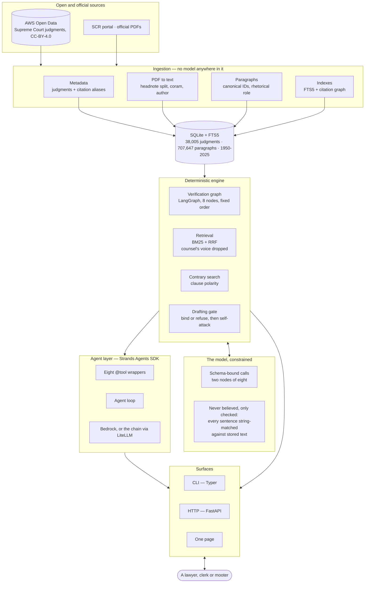
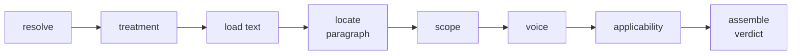

# Ruchi

**Citation integrity for Indian case law.** Ruchi reads a brief, finds every case-law citation, and
answers three questions separately about each one: does the case exist, which paragraph is actually
being relied on, and does that paragraph support the proposition *to the extent claimed*. It then
writes what opposing counsel will say.

[](LICENSE)
[](https://strandsagents.com/)

| | |
|---|---|
| **Live** | [ruchi.vihar.in](https://ruchi.vihar.in) |
| **Corpus** | Supreme Court of India — 38,005 judgments with full text, 707,647 paragraphs, 1950–2025 |
| **Data** | [AWS Open Data](https://registry.opendata.aws/indian-supreme-court-judgments/), CC-BY-4.0 |
| **Licence** | [Apache-2.0](LICENSE) |

---

## What it does

**Check a brief.** Every citation is resolved, located in the judgment, and read against the
paragraph it relies on. Each comes back **supported**, **checked and not supported**, or **not
checked** — and the third is never disguised as either of the others. It detects all twelve failure
modes in the taxonomy ([docs/PRD.md](docs/PRD.md)); **eight of them with no language model at all**.

**Find an authority.** A proposition in, judgments and the line out. Any passage that is not the
court speaking is dropped before ranking — an advocate states a rule more baldly than a judge does,
so counsel's submission out-matches the holding on keywords, and offering it as authority would hand
you the exact mistake the verifier exists to catch.

**Find the contrary.** The same retrieval read for the opposite sign: the judgment that says the
other thing, which is what you will meet in court.

**Draft a submission.** Each proposition is bound to an authority or refused. Nothing reaches the
document that the verifier could not confirm, and the draft arrives with the attack on itself already
written. Exports Markdown and .docx.

**Ask in plain words.** A Strands agent over the eight checks, so you need not know which one you want.

## The agent

Built with the [Strands Agents SDK](https://strandsagents.com/). One `Agent`, eight `@tool` functions
in [`src/orderorder/agent/tools.py`](src/orderorder/agent/tools.py), and a system prompt. Each tool
opens a session, calls one entry point that already existed, and returns JSON.

**The agent chooses the question, never the answer.** The verification graph still runs its eight
nodes in the same fixed, inspectable order; the agent cannot reorder one, skip one, or overrule a
verdict, and it has no path to the knowledge base except through a tool.

| Tool | Answers |
|---|---|
| `corpus_status` | what is held, so "not in this corpus" can be told from "no such authority" |
| `resolve_citation` | does this case exist, and which judgment does the citation name |
| `check_treatment` | is it still good law, and what did later benches do with it |
| `locate_paragraph` | which paragraph carries the claim, and does the cited one |
| `verify_brief` | every citation in a passage, all eight stages, findings by mode number |
| `find_authority` | which judgment backs a proposition, and which line |
| `find_contrary_authority` | which judgment says the opposite |
| `bind_proposition` | may this sentence be written, and behind which authority |

Every answer returns the list of tools that actually ran. An answer about subsequent history that
never called `check_treatment` came out of the model's memory, which the prompt forbids — and that is
visible without reading a log.

```bash
uv run orderorder agent "is (2019) 4 SCC 118 still good law, and what is against it?"
uv run orderorder agent --which          # which model is answering, and why

curl -X POST localhost:8000/api/agent -H 'Content-Type: application/json' \
     -d '{"question":"what does your corpus hold?"}'
```

**Model.** Bedrock by default; when no AWS credential resolves it falls back to the provider chain in
`LLM_PRIMARY` / `LLM_FALLBACKS` through LiteLLM — and reports which model answered, in every response,
on `/api/health`, and in `--which`.

## Architecture



**The load-bearing absence:** there is no edge from the agent loop to the knowledge base. Every path
runs through a tool, and every tool through a check that existed before the agent did.

The verification graph, stage by stage:



Nine further diagrams — ingestion, retrieval hierarchy, data model, verdict schema and state machine,
deployment, evaluation, and the agent layer in full — are in
[docs/ARCHITECTURE.md](docs/ARCHITECTURE.md).

## Run it

Requires [uv](https://docs.astral.sh/uv/) and Python 3.12. The environment script points every cache,
the interpreter and the virtualenv at one data directory, so the corpus and model caches stay off the
system drive. Set `ORDERORDER_DATA_DIR` to choose where; it defaults to `./data`.

```bash
git clone https://github.com/dhruvv1402/Ruchi.git
cd Ruchi

source scripts/dev-env.sh        # PowerShell:  . .\scripts\dev-env.ps1
uv sync
cp .env.example .env             # optional; defaults work for everything below

uv run orderorder doctor                          # check the environment
uv run orderorder init-db                         # create tables (SQLite by default)
uv run orderorder ingest metadata 2019 2020 2021  # import a few years
uv run orderorder ingest bulk-text                # fetch, clean and segment; resumable
uv run orderorder index                           # full-text index over every paragraph
uv run orderorder citator                         # who cited whom, and what they did with it
uv run orderorder stats
```

Then any of:

```bash
uv run orderorder verify --file brief.txt --memo   # every citation, and the opposing memo
uv run orderorder find "a misrepresentation vitiates consent only where it induced the contract"
uv run orderorder contrary "notice under Section 106 is mandatory before a suit for eviction"
uv run orderorder draft demo/plan.txt --docx out.docx
uv run orderorder agent "is INSC:2019:770 still good law?"
uv run orderorder serve                            # the page, on 127.0.0.1:8000
```

`uv run pytest` runs the suite: in-memory database, no network.

**A model is optional.** Eight of the twelve failure modes need none. For the other four, put a key in
`.env` — `GOOGLE_API_KEY`, `GROQ_API_KEY` or `CEREBRAS_API_KEY` — or AWS credentials for Bedrock.
`uv run orderorder doctor --probe` makes one real call and reports whether a filled schema came back.

### Deploy

```bash
ORDERORDER_API_TOKEN=$(openssl rand -hex 32) \
  ORDERORDER_DATA_DIR=/srv/orderorder-data \
  docker compose -f infra/docker-compose.yml --profile serve up -d --build
```

The corpus stays outside the image as a volume at `/data`; keys arrive as environment at run time,
never in a layer. The token has no default and the server refuses to start off-loopback without one.
The published port is `127.0.0.1:8000` — put a reverse proxy in front for anything else.

Full runbook, including Bedrock on EC2 and the IMDS hop limit that will otherwise send the agent
silently to a fallback model: [docs/DEPLOYMENT.md](docs/DEPLOYMENT.md) §4.

## What it scores

Measured on **forty judgments the detectors were not developed against**, against ground truth the
corpus supplies rather than labels anyone wrote.

Verification, 270 planted items, **no model configured**:

| mode | | recall |
|---|---|---|
| 1 | phantom citation | 40/40 |
| 2 | mis-cite | 40/40 |
| 3 | wrong court or bench | 39/39 |
| 5 | wrong voice | 34/34 |
| 9 | selective quotation | 20/20 |
| 10 | dead or wounded law | 14/14 |
| 12 | wrong pinpoint | 40/40 |
| | **false positives on clean citations** | **0/40** |

With a model, over the modes that need one and 25 clean citations: obiter as ratio 3/3, false
positives 0/25, **quote grounding 100%**, abstention 68%, six seconds a citation.

Reproduce with `uv run orderorder eval generate` then `uv run orderorder eval run --no-model --detail`.
What these numbers do *not* say is in [docs/ARCHITECTURE.md](docs/ARCHITECTURE.md) §11.4.

## Layout

```
src/orderorder/
  agent/          tools.py (eight @tool wrappers), assistant.py (the Strands agent and
                  the prompt), model.py (Bedrock, or the chain via LiteLLM)
  engine/         graph.py (the LangGraph StateGraph) and one module per check: locator,
                  quotes, scope, voice, weight, truncation, hierarchy, facts, citator,
                  search, contrary, authority, verdict, schemas
  citations/      grammar for SCC, AIR, SCR, SCALE, JT, INSC, HC neutral, IK ids
  ingest/         corpus client, metadata, pdf, segment, store, bulk, aliases, roles
  drafting/       plan, assemble, render, word, attack
  evaluation/     generate, run, retrieval, gate, contrary, gold
  web/            api.py, auth.py, limits.py, jobs.py, static/ (the page)
  db/ migrations/ models, session, alembic versions
docs/             PRD, ARCHITECTURE, TECH_STACK, DEPLOYMENT, AWS_DEPLOYMENT, ROADMAP
tests/            48 modules; in-memory database, no network
evals/            gold.jsonl, holdout.jsonl, and the reports
demo/             a brief, a plan, propositions, expected output
infra/            docker-compose.yml
```

| Document | Read it for |
|---|---|
| [docs/PRD.md](docs/PRD.md) | the problem, the twelve ways a citation lies, requirements, metrics |
| [docs/ARCHITECTURE.md](docs/ARCHITECTURE.md) | system design, ten diagrams, the agent layer at §15 |
| [docs/TECH_STACK.md](docs/TECH_STACK.md) | the stack, how LangChain, LangGraph and Strands are used, licence audit |
| [docs/DEPLOYMENT.md](docs/DEPLOYMENT.md) | what is ready to deploy, the security posture, the AWS runbook |
| [docs/ROADMAP.md](docs/ROADMAP.md) | the sprint, the startup phases, the decision log |

## Licence

**[Apache-2.0](LICENSE).** The judgment data it reads is separately licensed — see Attribution below.

## Attribution

Judgment data from the [Indian Supreme Court Judgments](https://registry.opendata.aws/indian-supreme-court-judgments/)
and [Indian High Court Judgments](https://registry.opendata.aws/indian-high-court-judgments/) datasets on
AWS Open Data (CC-BY-4.0). Lookups powered by [Indian Kanoon](https://api.indiankanoon.org/) where indicated.

*Ruchi is a research aid. The advocate remains responsible for every citation filed.*
