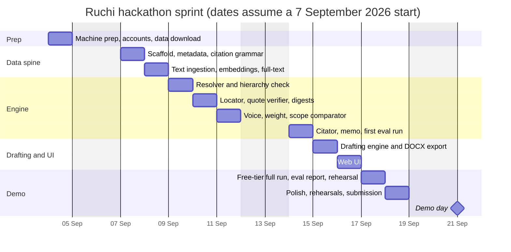
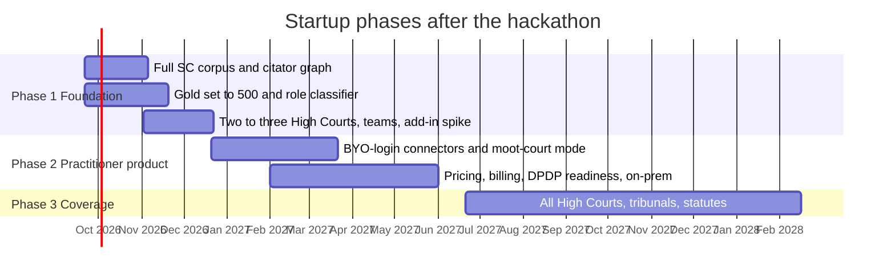

# Ruchi — Roadmap

| | |
|---|---|
| **Version** | 0.2 |
| **Date** | 9 September 2026 (0.1 written 4 September) |
| **Companion documents** | [PRD.md](PRD.md) · [ARCHITECTURE.md](ARCHITECTURE.md) · [TECH_STACK.md](TECH_STACK.md) · [DEPLOYMENT.md](DEPLOYMENT.md) |

Phase 0 is the hackathon sprint. Phases 1-3 take the same engine to a startup. Owners: **D** =
developer, **L** = law-student co-founder.

---

## 0. Where this actually is, 10 September 2026

The day-by-day plan below was written on 4 September for a sprint starting Monday the 7th. Five days
in, the engine's half of it is done and the plan is kept mainly as a record of what was expected —
because what was built is both **more** than it and **differently shaped**, and the differences are
the useful part of this document.

**Ahead of the plan.** The corpus is not the 2014-2025 subset but the **whole Supreme Court, 1950 to
2025**: **38,032 judgments, 707,647 paragraphs**, 38,005 with full text (the 27 that are not are PDFs
missing from the source). All **twelve** failure modes are implemented, not the eight scoped for the
MVP, and eight of the twelve are decided with **no model at all**. Everything is measured on
**held-out judgments the detectors were not developed against**, which the plan did not ask for and
which is the difference between a demo and a claim.

The corpus quadrupled on 9-10 September, and it is worth being precise that this was a **correction,
not an achievement**. A comment in `ingest/corpus.py` asserted the open-data bucket's Supreme Court
metadata began in 2013. It does not; it begins in 1950, and 2013 was simply the range this repository
had been built on. Nobody checked the assertion against the bucket until somebody did. That is the
same failure the engine exists to catch, one level up: a confident statement, plausible, load-bearing,
and never verified against the source. The fix was a flag.

**A caveat that matters for every number below.** The detector evaluations — recall by mode, false
positives, the drafting and contrary runs — were measured on the 2013-2025 corpus and have **not**
been re-run against 1950-2025. The reports in `evals/` are unchanged. Re-running them is the first
outstanding evaluation task, and until it happens the tables state which corpus they came from.

**Not in the plan at all.** A third direction: `orderorder contrary`, which reads the same retrieval for
the opposite sign and finds the judgment that says the other thing — no model involved, because what
separates a contradiction from a restatement is clause polarity rather than ranking. A self-attack on
the assembled draft built from the citation graph and bench strengths. And an **undermined** treatment
status, following the Constitution Bench's own words about decisions that followed an overruled case.

**Behind the plan, and in one case deliberately.**

| Planned | State |
|---|---|
| Day 2 embeddings on a Kaggle GPU | Built and **off by default**, and the reading has since been corrected. At the original four votes dense retrieval is destructive; at **one** vote it lifts paraphrase recall 42%→47% at five and 48%→56% at ten, and costs nine points on fragments. A trade, not a verdict: [ARCHITECTURE.md](ARCHITECTURE.md) §11.4 |
| Rhetorical role labels (day 2 in the plan, by LLM) | Built as a **cue classifier**, not a model, abstaining to `none`. `ingest/roles.py`, `orderorder ingest mark-roles` |
| A vector database (never in the plan) | Chroma as an optional second home for the same vectors, behind the `chroma` extra. Ranking still reads the memmap |
| Day 7 OCR of a scanned annexure | Not built. A brief with no text layer is reported as such rather than guessed at |
| Day 2 Docling parsing | Replaced by pypdfium2 and a publisher-specific cleaner ([TECH_STACK.md](TECH_STACK.md) §7) |
| Day 8 Next.js web UI | Replaced by one static page served by the API. All four surfaces are there |
| Days 4-6, L's 50-item gold set from real memorials | **The open item, and the important one.** The gold set is 70 items and the held-out set 313, all *planted by machine* in real judgments. That measures the detectors against ground truth the corpus supplies rather than labels anyone wrote — which is a real property, and is not the same as knowing the distribution of errors real advocates produce. Nothing here has yet been scored against a memorial a person wrote |
| Day 9 free-tier full run | Partly done, and it found the trap: the configured primary model had been **retired**, every call 404ed, every failure was correctly recorded as *not assessed*, and the report read like a result. See [ARCHITECTURE.md](ARCHITECTURE.md) §12 |
| Day 10 rehearsals, video, submission | Not started |

**Added because a box someone else uses needs it**, none of which was on the plan: a bearer token that
the binding makes mandatory, rate limits, security headers, bounded uploads, a non-root container image
with the corpus and keys outside it, CI that builds the image and checks it refuses to start open,
Alembic migrations inside the package, one stderr logger that never sees a prompt, and a job deadline.
[DEPLOYMENT.md](DEPLOYMENT.md) is that work.

**What the next few days are for**, in order: a memorial a person wrote, scored; the demo script and
rehearsals; the contrary search run over an assembled draft, which is ten lines and belongs beside the
rest of the self-attack; and BGE-M3 on a borrowed GPU, which is the one experiment the numbers point
at.

---

## 1. Phase 0: hackathon sprint (10 working days)

### 1.1 Scope

**In:** Supreme Court judgments only (English, roughly 2014-2025, from AWS Open Data); Surface A end to end for failure modes 1, 2, 4, 5, 6, 8, 10, 12; Surface B for one matter type (a commercial contract / fraud dispute) with the verification gate; DOCX export; minimal web UI; a 50-item gold set; the demo memorial.

**Out:** High Courts; the fact comparator beyond a single structured call; the citator beyond Indian Kanoon cited-by and own extraction; bring-your-own-login connectors; Word add-in; teams and billing; the retrained role classifier.

*Delivered against that scope:* the whole 2013-2025 SC corpus rather than a subset; **all twelve**
modes rather than eight; the fact comparator; the citator built from own extraction across the corpus,
with the bench-strength rule; and a third direction (`contrary`) that was not scoped. Still out, as
planned: High Courts, connectors, the add-in, teams and billing, the retrained role classifier.

### 1.2 Day-by-day plan, as written on 4 September

Kept as written. §0 is what happened. The engine column ran ahead of it and out of order; the
co-founder column is where the outstanding work is.

| Day | Developer (D) | Co-founder (L) | Exit criterion |
|---|---|---|---|
| **0** (prep, before the sprint) | Machine prep per [TECH_STACK.md](TECH_STACK.md) §9: free up the system drive, point Docker and Ollama at the data directory, install uv and Python 3.12. Indian Kanoon API token and non-commercial allowance request. Download the AWS Open Data SC parquet metadata and the 2014-2025 text. Create the free accounts (Groq, Google AI Studio, Cerebras, LangSmith, Kaggle, Hugging Face) and verify each key with one call. | Collect 5-10 real memorials with authors' permission. Choose the demo matter (contract fraud). Write the citation-format list (every reporter style seen in practice, with examples). | Data under `ORDERORDER_DATA_DIR`; memorials in hand |
| **1** | Monorepo scaffold; dev compose (postgres, ollama); LangGraph skeleton of the engine with stub nodes and a checkpointer; Alembic schema for judgment, text version, paragraph, alias, edge, verdict. Ingest parquet metadata into `judgment` and `citation_alias`. Citation grammar v1 with tests generated from L's list. | Draft the 8-citation demo memorial: 2 clean, 1 phantom, 1 overstated, 1 dissent-as-holding, 1 overruled, 1 counsel-argument-as-holding, 1 wrong pinpoint. Record the expected verdict for each. | `orderorder resolve` finds every real citation in the demo memorial by exact alias |
| **2** | Text ingestion for the subset: Docling parse, paragraph segmentation, canonical IDs, opinion boundaries (rules), full-text index; embed on a free Kaggle T4 session (CPU overnight on a smaller subset as the fallback) and import. CLI `orderorder ingest`. | Gold set v0: 20 items covering modes 1, 2, 4, 8, 12 from the memorials; label with paragraph IDs from the viewer-less CLI dump. | Every judgment in the demo memorial and gold set is segmented with printed labels captured |
| **3** | Resolver: exact, neutral citation, fuzzy party names, Indian Kanoon lookup with stub caching and attribution; metadata and hierarchy check; abstention codes. | Precedent-hierarchy rules as a table (Article 141, bench strength, territorial HC rule, dissent, obiter). Written-submission template (synopsis, list of dates, issues, arguments, prayer, table of authorities). | Fabrication recall 100% on gold v0 |
| **4** | Locator: hybrid search within a judgment, reranker, candidate set with claimed pinpoint injected; quote verifier with normalisation and offsets; pinpoint reconciliation; digest builder as a LangChain chain on a free long-context API, with the local 4B model for offline smoke tests. `orderorder verify` end to end for existence + location. | Gold set v1: extend to 50 items, adding modes 5, 6, 10; second-annotate 10 items. | Pinpoint hit@3 measured; quote-grounding 100% |
| **5** | Voice and opinion attribution; weight classifier (rule-assisted LLM); scope comparator: claim decomposition, NLI first pass, adjudicator schema with dropped qualifiers, modality, generality, narrowed proposition; selective-quotation check. | Review 20 engine verdicts against own judgment; write the opposing-counsel memo style guide with three worked examples. | Overstatement recall measured on gold v1 |
| **6** | Citator: own edges from ingested judgments + Indian Kanoon cited-by; treatment cue phrases + LLM; grade rubric; memo generation; first full eval run and retrieval tuning. | Label treatment for the gold set's mode-10 items; check the memo tone on 10 verdicts. | Eval report v1 with all P0 metrics |
| **7** | Drafting engine: case digest from uploaded documents (born-digital and one scanned page via PP-OCRv6), issue framing, authority retrieval and ranking, proposition drafting bound to paragraphs, gate policy, assembly from L's template, DOCX export with verification appendix. | Prepare the demo matter's documents (a contract, a notice, a reply, one scanned annexure) and the facts narrative; review the generated draft. | Draft exports with zero unverified propositions |
| **8** | Web UI: upload, verdict board with live progress, annotated brief, judgment viewer with paragraph highlight and version badge, memo panel, export; minimal drafting workspace (digest confirm, issues confirm, draft view, export). | Usability pass with two classmates on the stress-test flow; log confusions. | The demo script runs in the browser end to end on the development machine with the 4B model |
| **9** | Full run on the free tiers with all three providers and fallbacks configured; rebuild digests for the demo judgments on Kaggle; count the demo's model calls against each provider's daily limit; run the full eval; fix failures; verification report PDF; rehearsal 1 with timing. | Rehearsal 1 as presenter; tighten the narrative; prepare the hook slide (the July 2026 Supreme Court judgment; the "para 73 of 27" incident). | Demo under 7 minutes on free tiers; eval report v2 |
| **10** | Polish; rehearsals 2 and 3; record a backup video of the full run; submission package (repo, docs, eval report, video). | Final Q&A prep: what the engine cannot do, why self-hosted, data sources and licences, roadmap. | Submitted |

### 1.3 Demo script ("catch the fake citation", about 7 minutes)

| Time | Beat |
|---|---|
| 0:00 | Hook: the Supreme Court's July 2026 words on advocates citing unverified AI precedents; the Delhi High Court petition that cited paragraphs 73-74 of a 27-paragraph judgment. "Nobody reads 300 pages per citation. We built the thing that does." |
| 0:45 | Upload the demo memorial. The verdict board fills in live: eight citations, eight grades. |
| 1:45 | Click the phantom: sources checked, nothing found, fix suggested. Click the overstated one: judgment viewer opens on the highlighted paragraph; the dropped qualifier and the narrowed proposition are shown side by side with the memorial's sentence. |
| 3:00 | Click the dissent-as-holding (opinion badge) and the overruled one (treating judgment and paragraph). Click the wrong pinpoint: "you cited para 23; the text is at para 19 in the official version". |
| 4:00 | Open the opposing-counsel memo for the weakest citation. Export the verification report. |
| 4:45 | Switch to Draft mode: the contract-fraud matter's digest, confirmed issues, verified propositions with badges, one gate warning, DOCX export with the verification appendix. |
| 6:15 | Close: gold-set metrics, fully self-hosted on open data, what comes next. |

### 1.4 Cut list, in order, if time runs short

Written on 4 September. Four of the five are moot because the thing they would cut is built, and item
5 is the state anyway. Kept because a cut list is only useful before you need it.

1. ~~Surface B reduced to one issue and no self-attack.~~ Built, including the self-attack.
2. ~~Fact comparator removed (mode 11 shown as "phase 1").~~ Built: `engine/facts.py`.
3. ~~PDF report replaced by CSV export.~~ Reports are Markdown; the draft exports DOCX.
4. ~~Annotated brief removed; verdict board only.~~ Both built.
5. Indian Kanoon integration removed; the knowledge base alone decides existence, with an explicit "not in corpus" caveat instead of "phantom". **This is already how it works** — the corpus decides, the treatment report always states how many judgments it searched, and a lookup is a lead rather than a source of truth.

What would actually be cut now, in order: the drafting workspace, since verification is the product a
lawyer can use this month and [DEPLOYMENT.md](DEPLOYMENT.md) §1 says why drafting is not; then the
contrary search, which is a lead generator and costs a minute to explain; then the memo, which needs a
model and so needs the network to hold up.

### 1.5 Risks specific to the sprint

| Risk | Mitigation |
|---|---|
| A free tier rate-limits or goes down during the demo | Three providers behind LangChain fallbacks; local Ollama as the last resort; backup video. **And eight of the twelve modes need no model at all**, so the demo degrades to a smaller true claim rather than to nothing |
| ~~CPU embedding of the subset takes too long~~ | Resolved in a direction nobody expected: a static encoder does the whole corpus in four minutes, and the measurement then said dense retrieval does not help at this scale. Off by default; nothing on the demo path wants a GPU |
| Citation grammar misses formats in the memorials | L's format list on day 0; tests drive the grammar; NER catches names without citations |
| Demo network failure | Backup video recorded on day 10; the whole stack runs locally with reduced quality as a second fallback |
| **A configured model is retired and every call fails silently** | Met on 9 September, and the sharpest risk here because it does not look like a failure: every degraded check is honestly recorded as *not assessed*, so a dead model reads as a corpus with nothing to say. `orderorder doctor --probe` before every run, and watch the abstention rate |

---

## 2. Gantt

The sprint chart is the plan as drawn on 4 September, kept for the record. The engine work in it
finished ahead of the bars and out of their order — §0 is what actually happened — and the phase-1
chart below it still stands.

---

## 3. Phase 1: Foundation (months 1-3 after the hackathon)

| Goal | Deliverable | Owner | Exit criterion |
|---|---|---|---|
| Full Supreme Court corpus | **Done in phase 0, and it is the whole of it**: 38,032 judgments 1950-2025, 707,647 paragraphs, 38,005 with text. This closes the hole that mattered — on the 2013-2025 corpus 56% of citations pointed at cases it did not hold. What remains here is digests, built in batches on Kaggle sessions or the first paid GPU hours | D | Coverage report: every citation in the gold set resolves locally |
| Citator graph | **Own extraction done in phase 0**: 8,716 edges, 25 negative treatments each read against its judgment over four rounds, the bench-strength rule, and the *undermined* status. The graph is thin — 79% of the corpus is never cited within it — so the phase-1 work is the older corpus above, plus Indian Kanoon cited-by merged and L's labels | D, L | Treatment recall ≥ 90% on gold |
| Gold set to 500 | Items across all 12 modes; 20% double-annotated; agreement reported | L | Kappa reported; P1 metric targets in [PRD.md](PRD.md) §12 met |
| Retrained role classifier | Reconsidered. Voice and weight were built from the judgment's structure and its attributing cues, which hand a reader a quotable reason instead of a label. A classifier is worth training only if it beats that on ratio and obiter, which is the one place a model is still called | D | Beats the cue rules on L's labels, or is dropped |
| High Courts | Two or three courts chosen by user demand (likely Delhi, Bombay, Punjab and Haryana) with per-court neutral-citation prefixes | D | Same metrics on an HC gold subset |
| Teams | Workspaces, roles, audit log, admin console | D | A moot society uses one workspace |
| Word add-in spike | Verify-from-Word prototype | D | Go/no-go decision |
| Indian Kanoon terms | Written confirmation on caching fetched documents | D | Letter on file |
| Users | Three moot societies onboarded; weekly interviews; verdict overrides flowing into the gold set | L | Catch-rate and override metrics published monthly |

---

## 4. Phase 2: Practitioner product (months 4-9)

| Goal | Deliverable | Exit criterion |
|---|---|---|
| Bring-your-own-login connectors | Browser extension that performs lookups on Manupatra / SCC Online inside the user's own session; no bulk retrieval; results shown, not stored beyond the session | Legal review sign-off; ten practitioners using it |
| Moot-court mode | Bench memorandum and likely bench questions generated from the verified draft and counter-authorities | Adopted by two moots |
| Pricing and billing | Student free tier; practitioner subscription in INR; firm seats; Razorpay | First paying practitioners |
| Compliance | DPDP-ready consent, deletion and records ahead of the 2027 obligations; privilege notice and cloud-toggle consent flow reviewed by counsel | Counsel sign-off |
| On-prem package | Single-box installer with the prod compose profile for firms | One firm pilot |
| Cloud toggle | Anthropic provider through the official SDK with citations; consent record; zero-retention and region check | Available to consenting matters only |

---

## 5. Phase 3: Coverage (months 10-18)

- All 25 High Courts from AWS Open Data, sharded by court; tribunals (NCLT, NCLAT, ITAT) from official portals.
- Statute and amendment tracking; statutory-provision verification against bare-act text; supersession detection in the citator.
- Regional-language OCR and judgment ingestion beyond English and Hindi.
- Public accuracy benchmark on an open Indian gold subset.

---

## 6. Team split and rituals

| | Developer | Co-founder |
|---|---|---|
| Owns | Pipeline, engine, UI, infrastructure, evaluation harness, model choices | Gold set and labels, citation-format list, precedent-hierarchy rules, written-submission template, memo style, demo memorial and matter, user interviews, legal review of terms |
| Daily | 15-minute sync: yesterday, today, blockers | Same |
| Weekly (after the hackathon) | Eval report review; retrieval or model changes only with a metric | User interview digest; override review |
| Decision rule | Engine changes must not lower any P0 metric | Labels are the ground truth; disagreements resolved by a second annotator |

---

## 7. Decision log

### 7.1 Decided 4 September, before building

| Date | Decision | Reason | Held? |
|---|---|---|---|
| 2026-09-04 | Both surfaces in the MVP; verification engine is the core; drafting reuses it through a gate | Co-founder's problem statement is verification; the pipeline idea is drafting; one engine serves both | Yes |
| 2026-09-04 | Open and official data only; no Manupatra / SCC scraping | Their terms prohibit it; AWS Open Data is CC-BY-4.0 | Yes |
| 2026-09-04 | Fully self-hosted by default; cloud as a consented toggle | Privilege-waiver risk; DPDP; cost control | Yes |
| 2026-09-04 | Canonical paragraph IDs with text-version badges | Cross-reporter numbering is unresolved in the literature and was the hard ceiling in the Princeton benchmark | Yes |
| 2026-09-04 | Docling + PaddleOCR-VL; no PyMuPDF, MinerU, Marker, Surya | Licences | **No** — see 7.2 |
| 2026-09-04 | Rhetorical roles by local LLM now, retrained InLegalBERT later | OpenNyAI package unmaintained; label set retained | **No** — see 7.2 |
| 2026-09-04 | Postgres + pgvector only; Qdrant deferred | Corpus fits; one system for a team of two | **Narrowed** — see 7.2 |
| 2026-09-04 | Hackathon build is ₹0: free LLM API tiers behind LangChain fallbacks, free GPU notebooks for batch work, the development machine for the app | Development hardware is CPU-only; no budget now; the demo processes no privileged data | Yes |
| 2026-09-04 | LangChain + LangGraph as the orchestration layer, replacing the earlier Pydantic AI plan | Provider swapping across free tiers, a state graph that matches the verdict state machine, ready integrations, LangSmith's free plan | Yes for the first two reasons; the integrations were not used |
| 2026-09-04 | Named Ruchi, repository `order-order` | The courtroom call to order; replaced the first draft's working name | Yes |

### 7.2 Decided since, by building or by measuring

The ones marked **measured** are the useful entries: something was built, a number was taken, and the
number rather than an argument settled it.

| Date | Decision | Reason |
|---|---|---|
| 2026-09-05 | Ingest the **whole** 2013-2025 corpus rather than a subset | Bulk ingestion runs at ~0.4 s a judgment on eight workers, so the subset saved hours and cost the ability to say anything about coverage. 9,429 judgments, 5 genuine losses |
| 2026-09-05 | Docling dropped; pypdfium2 plus a cleaner written against this publisher | The SCR PDFs are born-digital and uniform, so the problem was never layout. It was telling the reporter's words from the court's — headnote, sign-off, margin letters, coram |
| 2026-09-05 | The editorial headnote and the editors' sign-off are stored apart and never resolve a pinpoint | A quote verified against the publisher's summary would be reported as the court's. Cutting the trailer removed 424,000 characters from judgments already stored |
| 2026-09-05 | Voice and weight decided from structure and attributing cues, never from a model; roles not labelled at all | A label is a model's opinion; a cue is a quotable reason a reader can check against the judgment. It also means a brief pinpointing a dissent is caught with no API key |
| 2026-09-05 | The cue that governs is the **last one before the sentence relied on** | A paragraph routinely sets out an argument and then rejects it |
| 2026-09-06 | SQLite as the default store; Postgres + pgvector kept wired and optional | 409,499 rows is a 300 MB matrix and a matrix multiply. One file, no service to run. `DATABASE_URL` switches it |
| 2026-09-06 | **Measured:** dense retrieval ships **off by default** | On the 2013-2025 corpus, fused at four votes, it took paragraph recall on paraphrases from 36% to 30%. **Superseded on 2026-09-10** — see below: at one vote it helps. The conclusion that survives is the discrimination test, which rules out a night on a bigger *CPU* model |
| 2026-09-06 | No reranker | It reorders the top 40; the failure is that the right paragraph is not in the top 400 |
| 2026-09-06 | **Measured:** selective quotation (mode 9) gets its own string check and no model | A run *with* a model scored it 0/20 — the model found the dropped condition every time and recorded it as mode 8. As a string operation it is 20/20 with nothing configured. The measurement did not tune the engine; it showed a check believed to need a model did not |
| 2026-09-06 | A bench cannot overrule one at least as large as itself; such claims are recorded as **doubted** | Arithmetic, not language. Reporting an overruling that did not happen would have an advocate drop a binding authority |
| 2026-09-06 | Treatment reports always state how many judgments were searched, and `good_law` separates "followed" from "never cited" | 79% of the corpus has never been cited within it; 56% of the citations these judgments make are to cases the corpus does not hold |
| 2026-09-06 | The **undermined** status: a judgment that relied on a case since overruled, one hop, reported as an inference from the graph | The Constitution Bench said it in terms: "all other decisions in which Pune Municipal Corpn. has been followed, are also overruled" |
| 2026-09-06 | A third direction, `contrary`, built: which judgment says the *other* thing | A contrary holding is the *nearest* text in the corpus, not the farthest — same subject, almost the same words. What separates it is clause polarity, which is grammar rather than ranking, so no model is needed or used |
| 2026-09-06 | **Measured:** shared terms weighted by corpus rarity rather than counted | Halves the spurious-lead floor (1.5 leads each to 0.7; 24 of 40 propositions to 12) for one true detection in twenty-one and no measurable time. `--no-weighted` reproduces the old behaviour |
| 2026-09-06 | Everything is scored on **held-out** judgments the detectors were not developed against | The set they were fixed on cannot measure them |
| 2026-09-09 | **Ingest 1950-2025, not 2013-2025** | The bucket always held it. A comment asserting otherwise was never checked against the source, which is the engine's own failure mode one level up. 38,032 judgments, 707,647 paragraphs, 27 PDFs missing at source |
| 2026-09-10 | Rhetorical roles built as a **cue classifier**, abstaining to `none` | A cue is a phrase in the judgment, so a disagreement is settleable by looking; a model's label is not. Retrieval needs them to tell the holding from the case history — voice and weight remain independent |
| 2026-09-10 | **`DENSE_VOTES` 4 → 1**, dense still off by default | Re-measured on the full corpus: one vote dominates four at every depth, and *helps* the row it was bought for. Off by default is now a trade — five points on paraphrases against nine on fragments — rather than a verdict that it does not work |
| 2026-09-10 | Chroma as an **optional extra**, not a dependency | 1.5.9 carries five open advisories with no fixed version. Keeping it out of the audited production set keeps the audit honest rather than suppressed; the cost is that CI cannot warn whoever enables it |
| 2026-09-10 | A fronted procedural participle marks a **recital**, not the brief's attribution | "Rejecting the plea, the High Court opined that ..." is the brief recounting the history below. Without the rule, every clean sentence lifted from a judgment that recounts the case below reads as failure mode 3 |
| 2026-09-10 | An **anonymised cause title asks for review** rather than passing | "State of U.P. v. Anr." token-matches hundreds of judgments at a passing score. The strings cannot answer it, so the engine asks — the third state, applied to resolution |
| 2026-09-07 | One static page, no Next.js, no Node | The page is a verdict board, a viewer, a search box and a drafting workspace. A toolchain bought none of that and had to be deployed alongside the engine |
| 2026-09-07 | The binding decides authentication: loopback asks nothing, anything else **requires** a token or the server refuses to start | A warning at boot is read once. An open server looks exactly like a closed one until somebody finds it |
| 2026-09-07 | Corpus and keys stay outside the image; the container runs as uid 10001 | The corpus is state that outlives the code; a key in a layer is published to whoever can pull it, and `docker history` shows it after deletion |
| 2026-09-07 | CI builds the image and asserts it fails to start open | Those guarantees are properties of the artefact that ships, not of the source |
| 2026-09-08 | Alembic wired, baseline = current schema, environment inside the package | `create_all` creates what is missing and never alters what is there, so it was never going to be how a deployed database changes shape. A migration you cannot run on the box you deployed to is not a migration |
| 2026-09-08 | One stderr logger; **prompts are never logged** | A prompt carries the brief; the brief is privileged; the guarantee is that it is not stored, and a log line would quietly undo it. `tests/test_logs.py` holds it |
| 2026-09-08 | Fifteen-minute job deadline, checked between citations; eviction prefers finished jobs | A Python thread cannot be killed from outside, so the verdicts already paid for are kept and the next one does not start |
| 2026-09-09 | Primary model moved to `gemini-3.6-flash`; `gemini-2.5-flash` retired | Google answers 404 on new keys. It failed in the way that costs most: every call degrades to *not assessed* by design, so a dead model is indistinguishable from a corpus with nothing to say. One run scored 100% abstention and mode 4 at 0/14 and **read like data** |

### 7.3 Still open

| Question | Reason it is open |
|---|---|
| Whether a strong encoder on a GPU closes the paraphrase gap | BGE-M3 on a borrowed session; the encoder is a flag and the store records which model wrote the vectors, so it is one command and a re-run of the numbers |
| Whether a contrary *lead* can become a *finding* | Only a reading can say whether a passage denies a proposition or confines the rule to other facts. The second reading is written and off by default until it has a number from something other than a laptop |
| A gold set from memorials a person wrote | Everything so far is planted by machine in real judgments. That is ground truth the corpus supplies rather than labels anyone wrote — a real property, and not the distribution real advocates produce |
| **Re-running every evaluation against the 1950-2025 corpus** | The detector numbers, the citator's edge count and its 79% uncited figure all belong to a corpus a quarter the size. Cheap to redo and several published claims are downstream of it |
| Embedding model (BGE-M3 vs Qwen3-Embedding) | Superseded in part: the question is no longer which encoder but whether any dense retrieval helps at this scale (7.2, 2026-09-06) |
| Trademark, domain and Bar Council advertising checks for the name | Needed before public launch, not before the hackathon |
| Indian Kanoon's position on caching fetched documents, in writing | Lookup only until confirmed |
